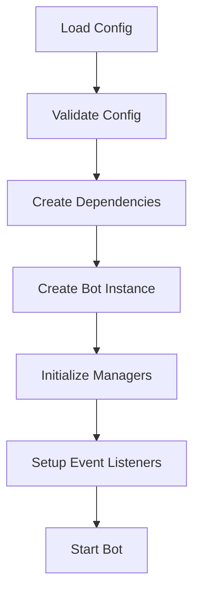

# Bot Initializer Implementation Plan

## Overview

The Bot Initializer is responsible for creating and configuring the Minecraft Bot instance with all its dependencies and managers. It follows the Dependency Injection pattern to make the system more testable and maintainable.

## Components

### 1. BotFactory

```typescript
interface BotFactory {
  createBot(config: BotConfig): Promise<MinecraftBot>;
}
```

Responsibilities:
- Creates and configures the MinecraftBot instance
- Sets up all required dependencies
- Initializes managers (WorldTracker, ToolManager, etc.)
- Configures event listeners
- Handles error recovery

### 2. Dependency Container

```typescript
interface DependencyContainer {
  getBot(): MinecraftBot;
  getWorldTracker(): WorldTracker;
  getToolManager(): ToolManager;
  getTaskParser(): TaskParser;
  // ... other dependencies
}
```

Responsibilities:
- Manages dependency lifecycle
- Provides dependency resolution
- Handles dependency configuration
- Supports dependency mocking for testing

### 3. Configuration Manager

```typescript
interface ConfigurationManager {
  loadConfig(): Promise<BotConfig>;
  validateConfig(config: BotConfig): void;
  updateConfig(config: Partial<BotConfig>): Promise<void>;
}
```

Responsibilities:
- Loads and validates bot configuration
- Handles configuration updates
- Manages configuration persistence
- Provides configuration validation

## Implementation Details

### 1. Bot Creation Flow



### 2. Error Handling

- Configuration validation errors
- Dependency initialization failures
- Bot connection failures
- Manager initialization failures

### 3. Recovery Strategies

- Automatic reconnection
- Configuration fallback
- Dependency reinitialization
- State recovery

## Testing Strategy

### 1. Unit Tests

- BotFactory tests
- DependencyContainer tests
- ConfigurationManager tests
- Individual manager tests

### 2. Integration Tests

- Full bot initialization flow
- Dependency interaction
- Configuration updates
- Error recovery

### 3. Performance Tests

- Initialization time
- Memory usage
- Resource cleanup
- Recovery time

## Monitoring and Observability

### 1. Metrics

- Initialization time
- Dependency load time
- Configuration load time
- Error rates
- Recovery success rate

### 2. Logging

- Configuration validation
- Dependency initialization
- Bot connection
- Manager setup
- Error recovery

## Future Improvements

### 1. Planned Features

- Dynamic dependency loading
- Configuration hot-reloading
- Advanced recovery strategies
- Performance optimizations

### 2. Potential Optimizations

- Lazy loading of dependencies
- Parallel initialization
- Caching strategies
- Resource pooling

## Security Considerations

### 1. Configuration Security

- Secure storage of credentials
- Configuration encryption
- Access control
- Audit logging

### 2. Dependency Security

- Dependency verification
- Version management
- Vulnerability scanning
- Security updates

## Documentation

### 1. API Documentation

- BotFactory interface
- DependencyContainer interface
- ConfigurationManager interface
- Manager interfaces

### 2. Usage Examples

- Basic initialization
- Custom configuration
- Dependency injection
- Error handling

## Dependencies

- mineflayer
- prismarine-biome
- lru-cache
- prom-client
- zod
- uuid
- vec3

## Related Components

- [World Tracker](../world/world_tracker.md)
- [Tool Manager](../tasks/tool_manager.md)
- [Task Parser](../tasks/task_parser.md)
- [Configuration Management](./configuration_management.md)
- [Error Handling](../error_handling/error_recovery.md) 